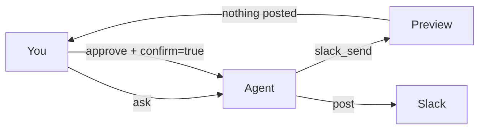

# agy-slack

**Slack, with manners, for [Google Antigravity](https://antigravity.google/) and [Gemini CLI v0.59](https://github.com/google-gemini/gemini-cli).**

Names instead of IDs. Confirm before send. One command to install.

[](https://github.com/salahuddinuqaili/agy-slack/actions/workflows/ci.yml)
[](package.json)
[](LICENSE)

```bash
npx github:salahuddinuqaili/agy-slack install --client antigravity
gemini extensions install https://github.com/salahuddinuqaili/agy-slack
```

In Antigravity CLI type `/mcp`, reload, then:

> Catch me up on #eng from this morning.

That’s the whole product. Fifteen agent-native tools, not two hundred raw Slack methods.

---

## Pick a path

<table>
<tr>
<td width="25%"><b>1. Antigravity</b><br/><code>agy</code>. Config: <code>mcp_config.json</code>.</td>
<td width="25%"><b>2. Gemini CLI v0.59</b><br/><code>gemini extensions install</code>.</td>
<td width="25%"><b>3. Demo</b><br/>No token. Fictional Northstar workspace.</td>
<td width="25%"><b>4. HTTP</b><br/>Field name depends on the client.</td>
</tr>
<tr>
<td>

```bash
export SLACK_USER_TOKEN=xoxp-...
npx github:salahuddinuqaili/agy-slack \
  install --client antigravity
```

Then `/mcp` → reload.

</td>
<td>

```bash
gemini extensions install \
  https://github.com/salahuddinuqaili/agy-slack
```

Then `/mcp`. Slash commands: `/slack:catchup`.

</td>
<td>

```bash
npx github:salahuddinuqaili/agy-slack demo
```

Ask: *What did Maya ship today?*

</td>
<td>

Antigravity: **`serverUrl`**

Gemini v0.59: **`httpUrl`**

```bash
npx github:salahuddinuqaili/agy-slack \
  serve --http --port 8787
```

</td>
</tr>
</table>

User token (`xoxp-`) is strongly recommended so search and DMs work. Bot token (`xoxb-`) is enough to post as the app in channels it has joined.

Verify the install:

```bash
npx github:salahuddinuqaili/agy-slack doctor --demo
```

---

## What the model actually calls

| Tool | Does |
|---|---|
| `slack_whoami` | Identity, workspace, token kind, safety mode |
| `slack_channels` | List / filter channels and DMs |
| `slack_users` | Find people by name, `@handle`, email, id |
| `slack_read` | Channel, DM, or thread as compact markdown |
| `slack_search` | Workspace search (`in:#eng from:@maya has:pin`) |
| `slack_unreads` | Catch-up across unread conversations |
| `slack_send` | Post or reply — confirm-gated |
| `slack_edit` | Edit a message |
| `slack_delete` | Delete a message |
| `slack_react` | Add / remove emoji |
| `slack_upload` | Small text / markdown / json files |
| `slack_create_channel` | Public or private channel |
| `slack_pins` | List / add / remove pins |
| `slack_status` | Set or clear your status |
| `slack_doctor` | Diagnose tokens, search, mode, allowlists |

**Resources:** `slack://workspace` · `slack://channels` · `slack://unreads` · `slack://me`

**Prompts:** `catch_up` · `standup` · `find_decision` · `draft_reply` · `incident_brief`

---

## Names, not IDs

These are all valid `channel` values:

```
#eng
eng
C0ENG
@maya
https://northstar-labs.slack.com/archives/C0ENG/p1757416260123456
```

Time windows for `since` / `latest`: `today`, `yesterday`, `monday`, `4h`, `90m`, `7d`, `1w`, `last 4h`, ISO dates, unix seconds.

Resolution is tested in CI against **1,000 colliding users** — unicode (`José`, `Søren`, `李伟`), fifty people named Alex, deleted accounts, dotted handles (`j.smith.0`), O'Briens, and prefix traps (`ann` / `anna` / `annabelle`).

- Exact `@handle`, email, and U-id always win.
- `ann` does not steal `annabelle`.
- `@Alex` with fifty Alexes returns the candidates instead of messaging a random one.
- Deleted people are skipped unless you pass their U-id.
- Allow lists accept `#eng` **and** `@maya`.

---

## Safety

`SLACK_MCP_MODE` is the rail Antigravity Ask mode actually needs.

| Mode | Reads | Writes |
|---|---|---|
| `readonly` | yes | blocked, with a reason |
| **`confirm` (default)** | yes | preview; resubmit with `confirm=true` |
| `write` | yes | sends immediately |



Optional rails:

```bash
SLACK_MCP_ALLOW_CHANNELS=#eng,#incidents,@maya
SLACK_MCP_DENY_CHANNELS=#all-hands
```

Tokens are never logged. `slack_doctor` redacts them.

<details>
<summary>Minimum Slack scopes</summary>

User-token scopes that make the full catalog work:

```
channels:history channels:read channels:write
groups:history groups:read groups:write
im:history im:read im:write
mpim:history mpim:read mpim:write
chat:write reactions:write
search:read
users:read users:read.email users.profile:write
files:write pins:write pins:read
```

Invite the bot to any private channel it should see (`/invite @your-app`).

This project does **not** use browser session tokens (`xoxc` / `xoxd`). That's a ToS risk and a trust problem for an MCP that sits on your agent.

</details>

---

## Why this exists

Slack already has an official hosted MCP, and there are community servers that wrap 200+ raw Web API methods. Neither is a good fit for Antigravity.

| | Official Slack MCP | Raw API wrappers | **agy-slack** |
|---|---|---|---|
| Install into Antigravity | OAuth app + `serverUrl` | Generic stdio JSON | **One command, exact config paths** |
| Tool surface | Hosted, not auditable | 200+ tools, poor tool-choice | **15 agent-native tools** |
| Channel / user refs | IDs | IDs | **`#eng`, `@maya`, permalinks** |
| Time windows | Dates | Unix | **`today`, `4h`, `7d`, `yesterday`** |
| Writes | Immediate | Immediate | **`readonly` / `confirm` / `write`** |
| Output | JSON dumps | JSON dumps | **Compact markdown** |
| Try without Slack | No | No | **`--demo` Northstar workspace** |

Antigravity CLI reads `~/.gemini/config/mcp_config.json` (and workspace `.agents/mcp_config.json`), uses **`serverUrl`** (not `url`) for HTTP, and runs MCP tools in **Ask mode** by default. agy-slack is built around that.

---

## Other clients

Gemini CLI v0.59 — **install as an extension** (session context + `/slack:catchup`):

```bash
gemini extensions install https://github.com/salahuddinuqaili/agy-slack
```

Settings-only (no extension context):

```bash
npx github:salahuddinuqaili/agy-slack install --client gemini
```

```bash
gemini mcp add -s user \
  -e SLACK_USER_TOKEN=$SLACK_USER_TOKEN \
  -e SLACK_MCP_MODE=confirm \
  --timeout 60000 \
  agy-slack npx -- -y github:salahuddinuqaili/agy-slack
```

Full Gemini notes — extension vs settings.json, `httpUrl` vs `serverUrl`, workspace trust, `excludeTools`: [docs/GEMINI.md](docs/GEMINI.md).

```bash
npx github:salahuddinuqaili/agy-slack install --client claude
npx github:salahuddinuqaili/agy-slack install --client cursor
npx github:salahuddinuqaili/agy-slack install --client all
```

SDK agents can attach the same process via `McpStdioServer` — see [`examples/sdk_agent.py`](examples/sdk_agent.py).

Withhold writes without an env change:

```json
{
  "mcpServers": {
    "agy-slack": {
      "command": "npx",
      "args": ["-y", "github:salahuddinuqaili/agy-slack"],
      "disabledTools": [
        "slack_send", "slack_edit", "slack_delete",
        "slack_react", "slack_upload", "slack_create_channel",
        "slack_status"
      ]
    }
  }
}
```

---

<details>
<summary>If something is wrong</summary>

| Symptom | Fix |
|---|---|
| Tools missing after install | Antigravity: `/mcp` and `~/.gemini/config/mcp_config.json`. Gemini CLI: `/mcp` and **`~/.gemini/settings.json`** (not mcp_config.json). |
| Gemini shows Disconnected | Trust the workspace. v0.59 fails closed and filters `mcpServers` in restricted mode. |
| Gemini HTTP does nothing | Use **`httpUrl`**, not `url` (SSE) or `serverUrl` (Antigravity). |
| `search` fails / empty | You need a **user** token (`xoxp-`) with `search:read`. Bot tokens cannot search. Run `doctor`. |
| Can't read a private channel | `/invite @your-app` in that channel. |
| Can't read DMs | User token. Bot tokens do not see IMs. |
| Nothing posts | Default is `confirm`. The model must resubmit with `confirm=true`, and Antigravity Ask mode must approve. |
| Posts too easily | Set `SLACK_MCP_MODE=readonly` or add `SLACK_MCP_ALLOW_CHANNELS`. |
| `Ambiguous user "alex"` | That's a feature. Call `slack_users` and pass a U-id or `@alex.kim`. |
| Time windows look wrong | Set `SLACK_MCP_TZ` to your IANA zone (`Europe/Berlin`). |
| Doctor says no token | `export SLACK_USER_TOKEN=xoxp-...` or pass `--demo`. |

Full notes: [docs/ANTIGRAVITY.md](docs/ANTIGRAVITY.md) · [docs/AUTH.md](docs/AUTH.md) · [SECURITY.md](SECURITY.md)

</details>

---

## Development

```bash
git clone https://github.com/salahuddinuqaili/agy-slack
cd agy-slack
npm install
npm test          # includes the 1000-user resolution suite
npm run typecheck
npm run build
node dist/index.js doctor --demo
```

Node 20+. MIT licensed. Not affiliated with Slack, Salesforce, or Google.

---

## License

MIT © Salahuddin Uqaili
